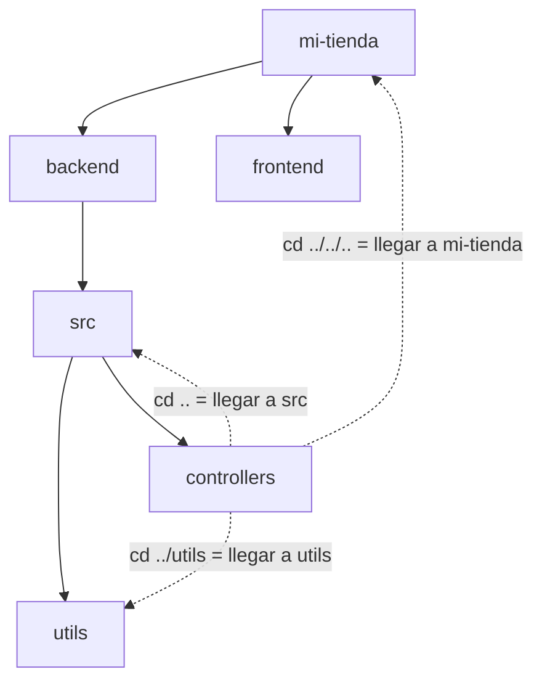
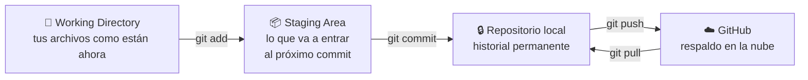
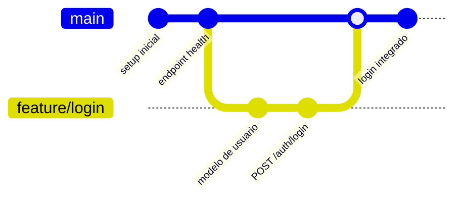
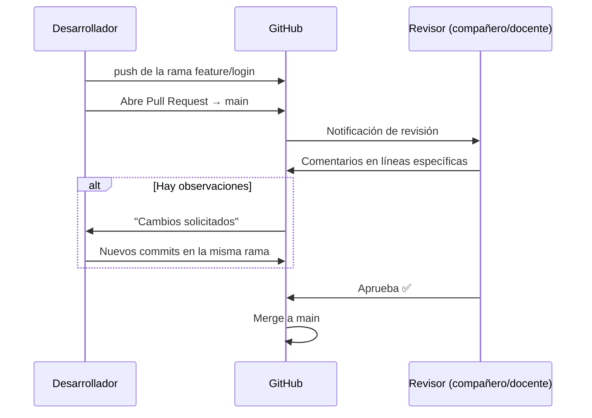
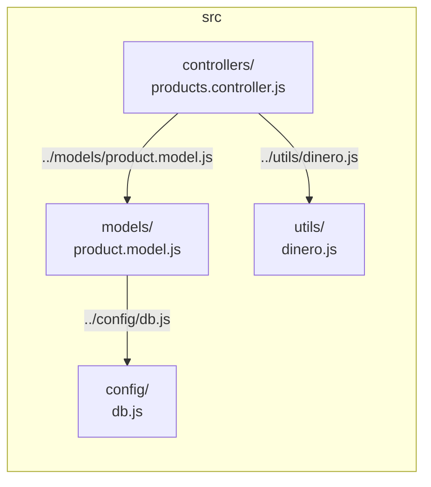
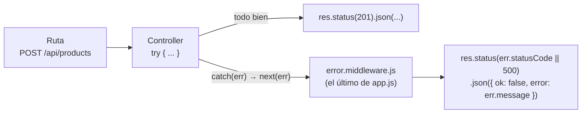

# Bloque 0 — Taller de fundamentos del desarrollador

**Duración: 14 horas clase** · 
**Competencia oficial que cubre:** *configuración del entorno de programación*.

---

## Por qué existe este bloque

Este bloque no es repaso: es la **caja de herramientas**. Todo lo que sigue en el semestre —levantar un servidor, entregar un repositorio, importar un módulo, atrapar un error— asume que ya dominas estas cuatro cosas. Un alumno que no sabe moverse en la terminal no pierde 5 minutos: pierde la clase completa, porque no logra ni llegar a la carpeta donde está el código.

En la industria a esto se le llama *developer experience básico*. Nadie te lo enseña en el trabajo; se da por hecho. Aquí sí te lo vamos a enseñar, y con la exigencia de que se vuelva automático.

> **Regla del bloque:** no se avanza al bloque 2.5 (CRUD) sin la lista de cotejo de este bloque completa. Es una **puerta**, no una sugerencia.

## Diagnóstico de entrada (30 min)

Antes de empezar, cada alumno responde en la práctica, en su computadora, sin ayuda y sin internet:

| # | Reto | ✅ / ❌ |
|---|---|---|
| 1 | Abre una terminal y muéstrame en qué carpeta estás parado | |
| 2 | Sin usar el explorador de archivos, crea la carpeta `prueba/src/utils` | |
| 3 | Estando en `utils`, regresa a `prueba` con un solo comando | |
| 4 | Crea un archivo `nota.txt` desde la terminal | |
| 5 | Convierte `prueba` en un repositorio Git y haz el primer commit | |
| 6 | Sube ese repositorio a tu cuenta de GitHub | |
| 7 | En un archivo `a.js`, importa una función que vive en `utils/b.js` | |
| 8 | Escribe una función que lance un error si recibe un número negativo | |

El docente registra los resultados. Ese conteo es la **línea base** del grupo y se vuelve a aplicar al cerrar el bloque: la diferencia entre ambas mediciones es la evidencia real de aprendizaje.

---

## 0.1 La terminal: hablarle a la computadora sin mouse (3 hrs)

### El cambio de mentalidad

El explorador de archivos te muestra **dónde estás**. La terminal te obliga a **saber dónde estás**. Es la misma computadora, los mismos archivos, la misma carpeta — solo cambia el instrumento.

Todo servidor de producción del mundo se administra así: una máquina en Render o en AWS no tiene escritorio ni iconos. Solo terminal. Cuando tu app se caiga a las 11 de la noche, la terminal será la única puerta.

### Lo único que tienes que entender: el prompt te dice dónde estás

```
C:\Users\ana\proyectos\mi-tienda>
                    └──────┬──────┘
              tu ubicación actual (working directory)
```

Cada comando que escribas se ejecuta **desde ahí**. El 90 % de los errores de principiante son un comando correcto ejecutado en la carpeta equivocada.

### Los comandos que usarás todos los días

| Quiero… | Windows (PowerShell) | Git Bash / Linux / Mac |
|---|---|---|
| Saber dónde estoy | `pwd` | `pwd` |
| Ver qué hay aquí | `ls` (o `dir`) | `ls` |
| Ver todo, incluso lo oculto | `ls -Force` | `ls -a` |
| Entrar a una carpeta | `cd frontend` | `cd frontend` |
| **Subir** un nivel | `cd ..` | `cd ..` |
| Subir dos niveles | `cd ..\..` | `cd ../..` |
| Volver a mi carpeta de usuario | `cd ~` | `cd ~` |
| Crear una carpeta | `mkdir src` | `mkdir src` |
| Crear carpetas anidadas de golpe | `mkdir src\utils -Force` | `mkdir -p src/utils` |
| Crear un archivo vacío | `ni app.js` | `touch app.js` |
| Borrar un archivo | `rm app.js` | `rm app.js` |
| Limpiar la pantalla | `cls` | `clear` |
| Abrir VS Code **aquí** | `code .` | `code .` |
| Detener un proceso (servidor) | `Ctrl + C` | `Ctrl + C` |

> 💡 **Dos atajos que cambian la vida:** la tecla `Tab` autocompleta nombres de carpetas y archivos (menos errores de dedo), y la flecha `↑` recupera el comando anterior. Un desarrollador experimentado casi no escribe rutas completas: las autocompleta.

### `.` y `..`: los dos símbolos que hay que memorizar

| Símbolo | Significa |
|---|---|
| `.` | **esta** carpeta, donde estoy parado |
| `..` | la carpeta **de arriba** (la que me contiene) |
| `~` | mi carpeta de usuario |
| `/` o `\` | separador entre carpeta y carpeta |

Esto no es trivia: en el bloque 0.3 verás que `import` usa **exactamente los mismos símbolos**. Quien entiende `cd ../..` entiende `import { algo } from "../../utils/fechas.js"` sin explicación adicional.



### Rutas absolutas vs relativas

- **Absoluta**: la dirección completa desde la raíz. `C:\Users\ana\proyectos\mi-tienda\backend\src`. Funciona desde donde sea, pero solo en **tu** computadora.
- **Relativa**: a partir de donde estás. `..\src` o `./utils`. Es la que se usa **dentro del código**, porque funciona en cualquier computadora del equipo.

> ⚠️ Por eso una ruta absoluta nunca se escribe dentro del código de un proyecto: el día que tu compañero clone el repo, `C:\Users\ana\...` no existe en su máquina.

### 🛠️ Actividad práctica 0.1 — El laberinto a ciegas

**Regla: el explorador de archivos queda prohibido. Si lo abres, empiezas de nuevo.**

1. Desde tu carpeta de usuario, crea con un solo comando la estructura:

```
laberinto/
├── nivel-1/
│   ├── nivel-2/
│   │   └── tesoro/
│   └── trampa/
└── salida/
```

2. Navega hasta `tesoro` y crea ahí un archivo `encontrado.txt`.
3. Desde `tesoro`, y **sin usar rutas absolutas**, crea un archivo `mapa.txt` dentro de `salida`.
4. Regresa a `laberinto` con un solo comando.
5. Escribe la lista de todos los comandos que usaste, en orden.
6. **Entrega:** captura de la terminal completa (se debe ver el historial) + tu lista de comandos comentada.

**Reto extra (para quien termine antes):** repite el ejercicio cronometrado. Menos de 90 segundos = dominio real.

---

## 0.2 Git y GitHub: la máquina del tiempo de tu código (5 hrs)

### El problema que resuelve

Todos hemos vivido esto:

```
proyecto_final.zip
proyecto_final_v2.zip
proyecto_final_v2_corregido.zip
proyecto_final_ULTIMO.zip
proyecto_final_ULTIMO_ahora_si.zip
```

¿Cuál era el bueno? ¿Qué cambió entre uno y otro? ¿Y si dos personas editaron el mismo archivo? Git resuelve las tres preguntas: guarda **cada versión con su explicación**, te deja regresar a cualquier punto y sabe combinar el trabajo de varias personas.

**Git** es el programa que corre en tu computadora. **GitHub** es el sitio en internet donde publicas ese historial para respaldarlo y compartirlo. No son lo mismo, igual que WhatsApp (app) no es tu teléfono.

### Los tres estados: el modelo mental completo



La analogía: el **working directory** es tu escritorio con papeles desordenados; el **staging area** es la carpeta donde vas metiendo solo los papeles que quieres archivar; el **commit** es sellarla y meterla al archivero con una etiqueta que dice qué contiene; el **push** es mandar una copia del archivero a una bodega segura.

### Configuración por única vez

```bash
git config --global user.name "Tu Nombre"
git config --global user.email "tucorreo@ejemplo.com"
```

Ese nombre y correo aparecerán en cada commit tuyo, para siempre. Usa el mismo correo de tu cuenta de GitHub.

### El ciclo diario (el 80 % de lo que harás)

```bash
git status                    # ¿qué cambió? — úsalo SIEMPRE, antes y después
git add .                     # prepara todos los cambios
git add src/app.js            # o solo un archivo
git commit -m "Agrega endpoint GET /api/products"
git log --oneline             # ve el historial compacto
```

### Conectar con GitHub

```bash
# 1. Crea el repositorio VACÍO en github.com (sin README)
# 2. En tu carpeta local:
git init
git branch -M main
git remote add origin https://github.com/tuusuario/mi-proyecto.git
git push -u origin main       # la primera vez lleva -u
git push                      # de ahí en adelante, solo esto
```

Para trabajar en un proyecto que ya existe:

```bash
git clone https://github.com/tuusuario/mi-proyecto.git
cd mi-proyecto
git pull                      # traer lo que subieron tus compañeros
```

### `.gitignore`: lo que NUNCA debe subir

```gitignore
node_modules/
.env
dist/
*.log
.DS_Store
```

`node_modules/` puede pesar 300 MB y se regenera con `npm install`: subirla es un error de principiante detectable a simple vista. `.env` contiene tus contraseñas: subirla es un **incidente de seguridad real**.

> 🔥 Si ya subiste un `.env` por accidente, borrarlo en el siguiente commit **no es suficiente**: sigue en el historial y cualquiera puede recuperarlo. Se considera que esa contraseña ya está comprometida y **hay que cambiarla**. Por eso el `.gitignore` va desde el commit #1.

### Ramas: trabajar sin romper lo que funciona

Una **rama** (*branch*) es una línea del tiempo paralela. `main` guarda la versión que funciona; cada cosa nueva se desarrolla aparte y solo se integra cuando está lista.



```bash
git switch -c feature/login   # crear rama y moverse a ella
# ...programas, haces commits normales...
git push -u origin feature/login

git switch main               # regresar a main
git merge feature/login       # integrar (opción local)
```

### Pull Request: la integración profesional

En un equipo real **nadie hace merge directo a `main`**. Se abre un **Pull Request (PR)** en GitHub: una propuesta de cambio que otra persona **revisa** antes de aceptarla.



En este curso, **el docente es el revisor de los PR**. Es la misma figura del "jefe inmediato" de la Unidad 1, ahora aplicada al código.

### Conflictos: no son un desastre, son una pregunta

Un **conflicto** ocurre cuando dos personas cambiaron **las mismas líneas** del mismo archivo. Git no adivina cuál es la buena: te pregunta.

```js
<<<<<<< HEAD
const IVA = 0.16;
=======
const IVA = 0.08;
>>>>>>> feature/precios
```

Resolverlo es literalmente: borrar las líneas `<<<<<<<`, `=======` y `>>>>>>>`, dejar el código correcto, guardar, y hacer `git add` + `git commit`. Eso es todo.

### Cómo se escribe un buen mensaje de commit

| ❌ Mal | ✅ Bien |
|---|---|
| `cambios` | `Agrega validación de stock en POST /products` |
| `asdf` | `Corrige cálculo de IVA que devolvía NaN` |
| `arreglé el bug` | `Evita error 500 cuando el id no existe (devuelve 404)` |

La prueba: dentro de tres meses, ¿ese mensaje te dice **qué** cambió y **por qué**, sin abrir el código?

### 🛠️ Actividad práctica 0.2 — De cero a Pull Request

**Parte A — individual (2 hrs)**

1. Crea la carpeta `git-practica` con la terminal (nada de explorador).
2. `git init`, crea un `README.md` con tu nombre, y haz tu primer commit.
3. Haz 4 commits más, cada uno con un cambio pequeño y un mensaje descriptivo.
4. Agrega un `.gitignore` con `node_modules/` y `.env`. Crea un archivo `.env` con `SECRETO=123` y comprueba con `git status` que **Git lo ignora**.
5. Súbelo a GitHub.
6. Ejecuta `git log --oneline` y toma captura de tus 5 commits.

**Parte B — en parejas (3 hrs)**

1. Uno crea un repo y agrega al otro como colaborador (Settings → Collaborators).
2. Ambos hacen `git clone`.
3. Cada quien crea su rama: `feature/nombre-a` y `feature/nombre-b`.
4. Cada quien modifica **la misma línea** del README (así provocan el conflicto a propósito).
5. El primero abre PR y hace merge. El segundo abre PR: GitHub marcará el conflicto.
6. Resuélvanlo **juntos**, comentando en el PR qué decidieron y por qué.
7. **Entrega:** URL del repo + captura del PR con comentarios + captura del conflicto resuelto + un párrafo de cada quien: *"¿qué pasó y cómo lo resolvimos?"*

### ✅ Higiene de Git para todo el semestre

- [ ] Un commit por idea completa, no uno al final del día con todo revuelto.
- [ ] Mensajes en presente y descriptivos.
- [ ] `git status` antes de cada `add`.
- [ ] `.env` y `node_modules/` jamás en el historial.
- [ ] `git pull` **antes** de empezar a programar cada sesión.
- [ ] Una rama por funcionalidad; `main` siempre debe funcionar.

---

## 0.3 Módulos en JavaScript moderno: `import` y `export` (3 hrs)

### El problema que resuelve

Un archivo de 800 líneas donde está todo —conexión a base de datos, rutas, validaciones, cálculos— es imposible de mantener y de repartir en equipo. Los **módulos** permiten que cada archivo tenga **una sola responsabilidad** y que los demás lo usen.

Es exactamente la estructura que verás en el bloque 2.4: `controllers/`, `services/`, `models/`, `utils/`. Cada archivo exporta lo suyo; los demás lo importan.

### Encender los módulos en Node

En `package.json` del backend:

```json
{
  "type": "module"
}
```

Sin esa línea, Node usa el sistema viejo (`require`) y `import` truena. Es el error #1 al empezar un backend.

### Export nombrado (el que usarás casi siempre)

```js
// src/utils/dinero.js
export const IVA = 0.16;

export function conIVA(precio) {
  return precio * (1 + IVA);
}

export function formatoMXN(precio) {
  return `$${precio.toFixed(2)} MXN`;
}
```

```js
// src/controllers/ventas.controller.js
import { conIVA, formatoMXN } from "../utils/dinero.js";

console.log(formatoMXN(conIVA(100))); // $116.00 MXN
```

Los nombres **deben coincidir exactamente** y van entre llaves.

### Export por defecto (uno por archivo)

```js
// src/models/product.model.js
import { Schema, model } from "mongoose";

const productSchema = new Schema({ name: String, price: Number });

export default model("Product", productSchema);
```

```js
// src/controllers/products.controller.js
import Product from "../models/product.model.js";   // sin llaves, y el nombre lo eliges tú
```

| | Export nombrado | Export por defecto |
|---|---|---|
| Cuántos por archivo | Los que quieras | Solo uno |
| Cómo se importa | `import { x } from "..."` | `import loQueSea from "..."` |
| ¿El nombre debe coincidir? | Sí | No |
| Típico para | Funciones utilitarias, constantes | El "protagonista" del archivo: un modelo, un router |

### Las rutas: aquí regresa el bloque 0.1

```
backend/src/
├── config/
│   └── db.js
├── controllers/
│   └── products.controller.js     ← estás aquí
├── models/
│   └── product.model.js
└── utils/
    └── dinero.js
```

Parado en `products.controller.js`:

| Quiero importar | Ruta que escribo | Por qué |
|---|---|---|
| Otro archivo de `controllers/` | `./users.controller.js` | `.` = mi propia carpeta |
| `product.model.js` | `../models/product.model.js` | `..` = subo a `src`, luego bajo a `models` |
| `dinero.js` | `../utils/dinero.js` | igual: subo y bajo |
| `db.js` | `../config/db.js` | igual |
| Un paquete de npm (`express`) | `express` | **sin `./`**: así Node sabe que es de `node_modules` |



> 🔑 **La regla de oro:** `./` significa "empieza a buscar desde donde estoy". Si no lleva `./` ni `../`, Node lo busca en `node_modules`. Por eso `import express from "express"` no lleva punto y `import Product from "./models/product.model.js"` sí.

### Las dos trampas clásicas

1. **Olvidar la extensión `.js`.** En Node con módulos ESM es **obligatoria**: `from "../utils/dinero"` truena; `from "../utils/dinero.js"` funciona. (En el frontend con Vite sí puedes omitirla — por eso confunde.)
2. **Importación circular.** `a.js` importa `b.js` y `b.js` importa `a.js`. Uno de los dos recibirá `undefined`. Si te pasa, es señal de que esa lógica compartida debe salirse a un tercer archivo en `utils/`.

### 🛠️ Actividad práctica 0.3 — Operación desmantelamiento

Se te entrega `tienda-monolito.js`: un archivo de ~150 líneas que tiene todo revuelto (datos de productos, cálculos de precios, formato de fechas, validaciones y un "reporte" que imprime en consola).

1. Analiza el archivo y **agrupa** su contenido por responsabilidad.
2. Crea la estructura y reparte el código:

```
tienda/
├── package.json          ← con "type": "module"
├── index.js              ← solo orquesta: importa y ejecuta
└── src/
    ├── data/productos.js
    ├── utils/dinero.js
    ├── utils/fechas.js
    └── services/reporte.service.js
```

3. `index.js` no debe tener lógica: solo imports y las llamadas.
4. Ejecuta `node index.js` y verifica que la salida sea **idéntica** a la del monolito.
5. Provoca a propósito 2 errores de importación (quita la extensión `.js`; pon `./` donde va `../`), captura el mensaje exacto de Node y explica qué significa.
6. **Entrega:** repositorio en GitHub con al menos 4 commits que muestren el proceso de separación + capturas de los 2 errores explicados.

---

## 0.4 Flujo, errores y JSON: cómo se comporta un backend serio (3 hrs)

### `if/else` con estilo profesional: *guard clauses*

Los principiantes anidan; los profesionales **salen temprano**. Compara:

```js
// ❌ Escalera de la muerte: difícil de leer, fácil de romper
function crearProducto(datos) {
  if (datos) {
    if (datos.name) {
      if (datos.price > 0) {
        if (datos.stock >= 0) {
          return guardar(datos);
        } else {
          return "stock inválido";
        }
      } else {
        return "precio inválido";
      }
    } else {
      return "falta nombre";
    }
  }
}
```

```js
// ✅ Guard clauses: primero descarto lo malo, al final queda lo bueno
function crearProducto(datos) {
  if (!datos)             throw new Error("No se recibieron datos");
  if (!datos.name)        throw new Error("El nombre es obligatorio");
  if (datos.price <= 0)   throw new Error("El precio debe ser mayor a 0");
  if (datos.stock < 0)    throw new Error("El stock no puede ser negativo");

  return guardar(datos);   // si llegué aquí, todo está bien
}
```

La segunda versión se lee como una lista de condiciones de entrada. Así están escritos los controllers de los repos de ejemplo.

### `throw`: lanzar un error con significado

`throw` **interrumpe** la función y avienta el error hacia arriba, a quien la llamó. Un error sin información es inútil; un error del curso lleva **mensaje y código HTTP**:

```js
// src/utils/AppError.js
export class AppError extends Error {
  constructor(mensaje, statusCode = 400) {
    super(mensaje);
    this.statusCode = statusCode;
  }
}
```

```js
import { AppError } from "../utils/AppError.js";

if (!producto) throw new AppError("Producto no encontrado", 404);
if (producto.stock < cantidad) throw new AppError("Stock insuficiente", 409);
```

### `try / catch`: atrapar lo que puede fallar

```js
try {
  // código que PUEDE fallar
  const producto = await Product.findById(id);
} catch (err) {
  // qué hago si falló
  console.error(err.message);
} finally {
  // opcional: se ejecuta pase lo que pase
}
```

**¿Qué va dentro del `try`?** Todo lo que dependa de algo que no controlas: la base de datos, la red, un archivo, datos que mandó el usuario. Un `2 + 2` no necesita `try/catch`.

> ⚠️ Con `async/await`, **un `await` sin `try/catch` puede tumbar el servidor completo**. Esa es la razón por la que verás `try/catch` en absolutamente todos los controllers de los repos.

### `next(err)`: la cadena de errores de Express

En Express no respondes el error dentro de cada controller: se lo pasas a `next()`, y un **middleware central** decide qué responder. Así el formato de error es idéntico en toda la API, escrito una sola vez.



```js
// src/controllers/products.controller.js
export const getOne = async (req, res, next) => {
  try {
    const producto = await Product.findById(req.params.id);
    if (!producto) throw new AppError("Producto no encontrado", 404);
    res.json({ ok: true, product: producto });
  } catch (err) {
    next(err);            // ← no respondo aquí: delego
  }
};
```

```js
// src/middlewares/error.middleware.js  (se registra AL FINAL de app.js)
export const errorHandler = (err, req, res, next) => {
  const status = err.statusCode || 500;
  console.error(`[${status}] ${err.message}`);
  res.status(status).json({ ok: false, error: err.message });
};
```

> 🔑 El middleware de errores es el único con **cuatro** parámetros `(err, req, res, next)`. Así lo reconoce Express. Y va **hasta el final** de `app.js`, después de todas las rutas.

### JSON: el idioma entre cliente y servidor

**JSON** (JavaScript Object Notation) es texto plano con la forma de un objeto de JavaScript. Es lo que viaja por HTTP, porque por la red solo viaja texto.

```json
{
  "ok": true,
  "product": { "id": "a1", "name": "Jugo", "price": 18, "stock": 40 },
  "tags": ["bebida", "frío"]
}
```

Reglas que rompen a todos: **las llaves van entre comillas dobles**, no se admiten comillas simples, no hay comentarios, no hay coma después del último elemento, y no existen funciones ni `undefined`.

| Operación | Código | Qué hace |
|---|---|---|
| Objeto → texto | `JSON.stringify(obj)` | Para guardar o enviar |
| Texto → objeto | `JSON.parse(texto)` | Para leer lo que llegó |
| Responder desde Express | `res.json(obj)` | Hace el `stringify` y pone el header por ti |
| Leer el body de una petición | `app.use(express.json())` | Sin esta línea, `req.body` es `undefined` |

> ⚠️ `JSON.parse` de un texto mal formado **lanza** una excepción. Si vas a parsear algo que viene de fuera, va dentro de un `try/catch`. Aquí es donde se conectan los dos temas de este bloque.

### El contrato de respuesta del curso

Toda la API responderá siempre con la misma forma. Esto no es capricho: es lo que le permite al frontend escribir el manejo de errores **una sola vez**.

```js
// Éxito
{ "ok": true, "products": [ ... ] }

// Error
{ "ok": false, "error": "Producto no encontrado" }
```

### 🛠️ Actividad práctica 0.4 — Rompe la API a propósito

Partiendo de un mini-servidor Express que se te entrega (un solo recurso, sin validaciones):

1. Agrega la clase `AppError` y el middleware central de errores.
2. Convierte los `if` anidados del controller en *guard clauses*.
3. Haz que la API responda correctamente a **estos seis escenarios**, y prueba cada uno con Thunder Client:

| # | Escenario | Status esperado | Body esperado |
|---|---|---|---|
| 1 | GET de un id que sí existe | 200 | `{ ok: true, product: {...} }` |
| 2 | GET de un id que no existe | 404 | `{ ok: false, error: "..." }` |
| 3 | POST sin el campo `name` | 400 | `{ ok: false, error: "..." }` |
| 4 | POST con `price` negativo | 400 | `{ ok: false, error: "..." }` |
| 5 | POST con JSON mal formado (quita una comilla a propósito) | 400 | `{ ok: false, error: "..." }` |
| 6 | Ruta que no existe (`/api/fantasma`) | 404 | `{ ok: false, error: "..." }` |

4. Comprueba que **el servidor sigue vivo** después de los seis: ningún error debe tumbarlo.
5. Quita a propósito la línea `app.use(express.json())`, manda un POST, observa qué pasa con `req.body` y explica por qué.
6. **Entrega:** repo + colección de Thunder Client con los 6 casos + tabla con lo que respondió realmente cada uno.

---

## 🔗 Puente hacia el resto de la Unidad 2

Lo que acabas de aprender no se queda aquí; reaparece toda la unidad:

| De este bloque | Reaparece en |
|---|---|
| Terminal (`cd`, `mkdir`) | 2.1 al levantar los stacks, 3.3 al migrar la base de datos |
| Git, ramas y PR | Toda entrega del semestre; en 3.4 cada `git push` redespliega tu app |
| `import` / `export` y rutas `./` `../` | 2.4 estructura backend, 2.8 servicios del frontend |
| `throw` + `try/catch` + `next(err)` | 2.5 CRUD, 2.7 autenticación |
| JSON y el contrato `{ ok, ... }` | 2.6 pruebas de API, 2.8 consumo desde React |

Y hay una continuación natural: en el bloque **2.2** verás que **TypeScript** revisa esos objetos **antes de ejecutar** y que **Zod** los revisa **cuando llegan de fuera**. Las validaciones a mano que escribiste aquí en la actividad 0.4 se convertirán en tres líneas de Zod — pero solo se aprecia el ahorro si primero las escribiste a mano.

---

## ✅ Lista de cotejo — Bloque 0 (puerta de acceso al bloque 2.5)

**Terminal**
- [ ] Navego a cualquier carpeta del proyecto sin usar el explorador de archivos.
- [ ] Creo carpetas anidadas y archivos desde la terminal.
- [ ] Explico la diferencia entre ruta absoluta y relativa, y por qué en el código va la relativa.

**Git y GitHub**
- [ ] Inicializo un repositorio y hago commits con mensajes descriptivos.
- [ ] Subo y bajo cambios de GitHub (`push` / `pull`).
- [ ] Creo una rama, abro un Pull Request y hago merge.
- [ ] Resolví al menos un conflicto real.
- [ ] Mi `.gitignore` protege `.env` y `node_modules/` desde el primer commit.

**Módulos**
- [ ] Uso export nombrado y por defecto, y sé cuándo va cada uno.
- [ ] Escribo correctamente rutas con `./` y `../` entre carpetas hermanas y superiores.
- [ ] Distingo un import de archivo propio de uno de `node_modules`.

**Flujo, errores y JSON**
- [ ] Escribo validaciones con *guard clauses* en lugar de `if` anidados.
- [ ] Lanzo errores con mensaje y código HTTP, y los atrapo con `try/catch`.
- [ ] Delego el error con `next(err)` a un middleware central.
- [ ] Leo y escribo JSON válido, y explico qué hace `express.json()`.
